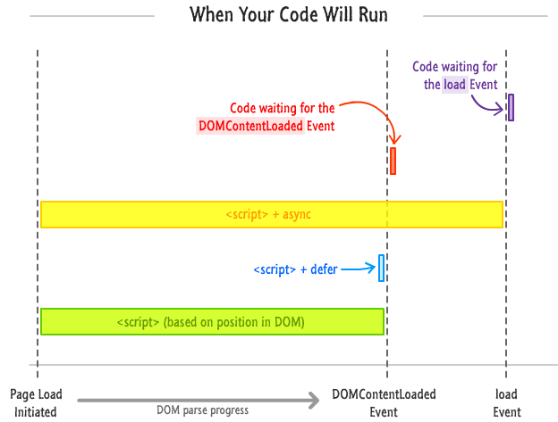

####js퀴즈

- 스크립트 해석 및 실행이 DOM이 완성되기 전에 처리 되므로 별도의 이벤트 감지를 통해 객체에 접근해야 한다.

- 변수 선언시 변수 이름 사이 공백에는 하이픈`-` 쓸 수 없다
- 이름에 사용할 수 있는 특수문자는 `$`, `_` 뿐임

- `null`, `undefined`는 객체가 아님
> 자바스크립트의 모든객체는 Object(생성자constructor이자 함수)로부터 시작.  
> 
> Object가 가진 메소드는 Object로부터 생선된 모든 객체(인스턴스)에 상속된다. 
> 
> Object가 가진 .toString()메소드 있다면 객체 
> 
> .toString()메소드가 없다면 객체가 아님
> 
> !! 형변환 통해 해당 인스턴스가 .toString()메소드를 가지고 있는지 아닌지 확인 가능
> 
> !!(2016).toString :true
> 
> !!(function(){}).toString :true
> 
> !!null.toString : error

- 이벤트 속성의 초기값은 null/ 변수의 초기값은 undefined

- 전역에서 사용 가능한 함수 : 전역함수. window는 전역객체.
- window.setTimeout(할일, 시간) setTimeout은 전역함수!

- html 요소 선택하는 방법
    + document.documentElement
    + document.body.parentNode
    + document.head.parentNode
    + document.firstChild.nextSibling
        * 표준모드에서 document.firstChild는 HTML 요소가 아니라 `doctype`임!

- DOM API에서 지원하는 방법
    + 선택(selection)
    + 사건(events)
    + 조작(manipulation)
    + 탐색(traversal)
    + 유효성검사(validation), 지리(geolocation)은 HTML5에 포함된것. DOM에서는 지원하지 않는다.

- 함수 내부에 변수 선언시 `var`, 코드 마지막에 `;` 꼭 붙이자!

----------------

###DOM 탐색
- childNodes : 모든 자식노드 찾음
- children : 자식노드 중 요소노드만 찾음